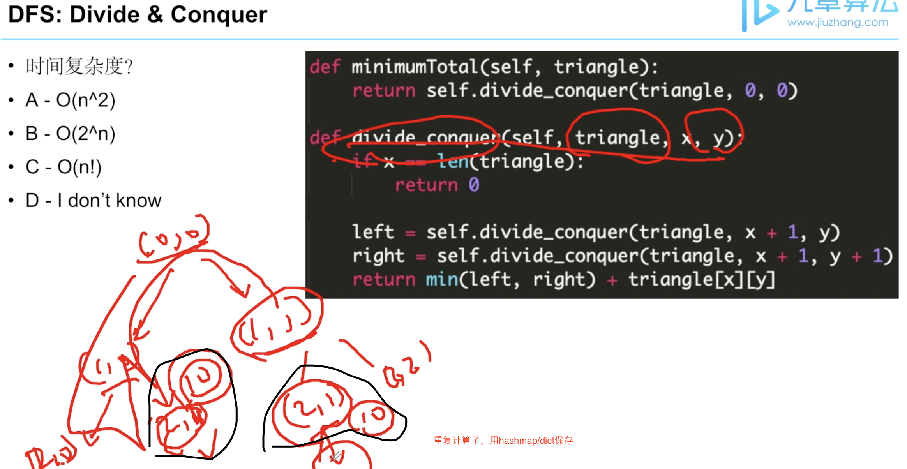
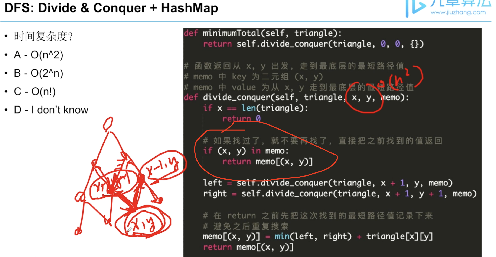

欢迎来到『九章算法班 2021 版』的第22节课，今天我们一起来学习『从搜索到动规——记忆化搜索入门』

从这一章开始，我们逐步学习动态规划这个重要的算法思想。

# 记忆化搜索
本章的主要内容是从**搜索**向**动态规划**进行过渡，学习记忆化搜索的相关知识。

本章关键字：Recursion（递归）、Memoization（记忆化搜索）、 Dynamic Programming（DP、动态规划）

首先我们先来利用遍历与分治解决这道数字三角形问题。

# 用遍历与分治解决数字三角形问题

- 第二十二章【互动】从搜索到动规——记忆化搜索入门 1 - 用遍历与分治解决数字三角形问题.mov

在下面的数字三角形中，从顶端走到底端所能获得的最小路径长是多少？
```
[
[3],
[4,1],
[2,7,2],
[5,3,4,6]
]
```
- A:
10
- B:
12
- C:
14
- D:
18

3 + 1 + 2 + 4 = 10（从根开始，右右左）。
正确答案是 A

此时算法的时间复杂度应该是多少？
- A:
O(n^2)
- B:
O(2^n)
- C:
O(n!)
- D:
O(n)

所有的路径数量是2^n。

正确答案是 B 

而此时算法的时间复杂度应该是多少？
- A:
O(n^2)
- B:
O(2^n)
- C:
O(n!)
- D:
O(n)

所有的路径数量是2^n，没有任何实质上的剪枝，所以仍然是O(2^n)。

正确答案是 B 

# LC

[109. Triangle](../lintcode/109.Triangle.md)


我们发现无论是我们学过的遍历还是分治，都无法得到理想状态的时间复杂度。

如果能把我计算过的路径记录下来，是不是会更快呢？

我们一起来看下面的视频。

# 用记忆化搜索解决数字三角形问题

- 第二十二章【互动】从搜索到动规——记忆化搜索入门 2 - 用记忆化搜索解决数字三角形问题.mov

## 记忆化搜索Memoization Search
- 使用HashMap/Dict记录搜索的中间结果从而避免重复计算的算法
- 将函数的计算结果保存起来，下次通过同样的参数访问时，直接返回保存下来的结果
- 将指数级别的时间复杂度降到多项式级别

## 对这个函数的限制？
- 函数需要有参数和返回值
- 函数需要时pure function，即结果只和传入参数有关和其他无关
- 和系统设计中的cache很像




因为我们已经以一种方式（HashMap）记录了所有路径。所以每一对x和y只出现了一次，也就是 n^2 级别，相当于每一对起点终点都计算了一次，也就是 O(n^2) 。


# 记忆化搜索的缺陷

并不是所有的算法都适用于所有的问题，那么记忆化搜索可能会出现什么样的问题呢?

下面让老师借用一道经典的巴什博弈（Bash Game）来说明。

- 第二十二章【互动】从搜索到动规——记忆化搜索入门 3 - 记忆化搜索的缺陷.mov


- 记忆化搜索的缺点：
    - 如果时间复杂度和递归深度都是O(n)级别则会栈溢出 (eg. 1300 bash game)（递归级别别超过10万）
    - 如果时间复杂度是O(n^2)级别，递归深度是O(n)级别就不会栈溢出 （eg. 109 triangle）
    - 不适合解决O(n)时间复杂度的DP问题，有stackoverflow的风险
- 记忆化搜索的优点：
    - 从搜索转化来，所以思维模式比较简单，在原来搜索基础上加几行代码即可
    - 实现起来不容易出错，依赖关系简单，可直接从依赖关系的逻辑转化为代码


你认为这段代码的最主要的问题在哪里?
- A:
运行时间无法接收。
- B:
递归深度过高。
- C:
边缘数据没有进行判断。
- D:
我感觉写得挺好，没啥问题。


这个问题的时间复杂度是 O(n) 级别，所以时间上我们可以接受，但是因为时间是 O(n)，最差情况的递归深度就变成了 O(n)，这是很容易爆栈（stack overflow）的。
而递归出口就是边缘数据的判断，因此不存在选项C的情况。
正确答案是 B 

# LC
[1300. Bash Game](../lintcode/1300.Bash_Game.md)


在这一章中，我们成功的从DFS过渡到了DP，在下一章中我们将进行DP的入门训练，我们不见不散。