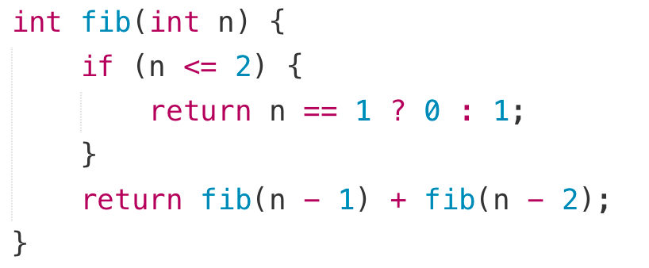

- Part 1 递归三要素 Recursion 3 key parts 
- Part 2 递归调用栈 (内存的堆栈 函数调用栈) Recursion with stack and heap 
- Part 3 值传递与引用传递 Pass by value vs Pass by reference 
- Part 4 综合训练 More practices 

# 递归定义

- 当函数直接或者间接调⽤⾃⼰时，则发⽣了递归.
- 递归的定义: 参⻅ "递归的定义".
- 递归缩写:

    • Bing - Bing Is Not Google

    • GNU - GNU's Not Unix

    • PHP - PHP: Hypertext Preprocessor

# 递归三要素

- 递归的定义：接受什么参数，返回什么值，代表什么意思

- 递归的拆解：每次递归都是为了让问题规模变⼩

- 递归的出⼝：必须有⼀个明确的结束条件

=> 得到⼀个可供其他函数调⽤的递归函数

## 例子 斐波那契数列

- 定义: 斐波那契数列指的是这样⼀个数列 0, 1, 1, 2, 3, 5, 8, 13, 21, 34........这个数列从第3项 开始, 每⼀项都等于前两项之和.

- 关系式: F i= F i−1 + F i−2

