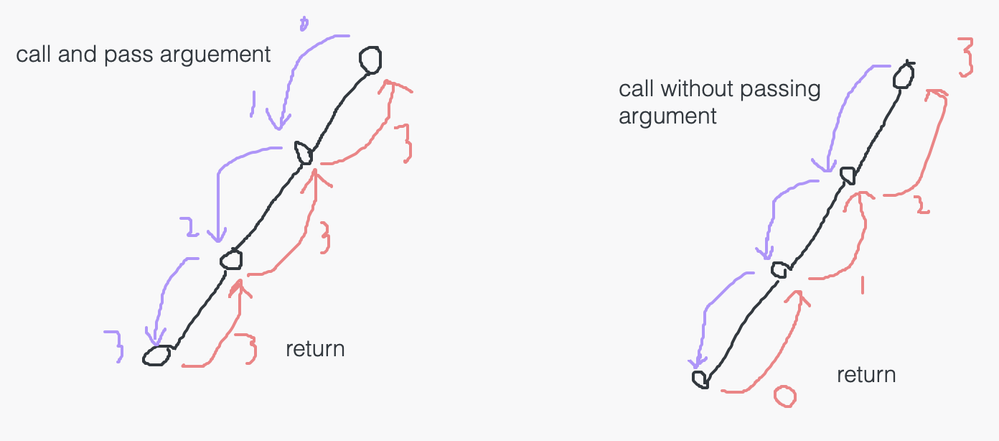

110. Balanced Binary Tree

简单

https://leetcode.cn/problems/balanced-binary-tree/


Given a binary tree, determine if it is height-balanced.

For this problem, a height-balanced binary tree is defined as:

a binary tree in which the left and right subtrees of every node differ in height by no more than 1.

 

Example 1:


Input: root = [3,9,20,null,null,15,7]

Output: true

Example 2:


Input: root = [1,2,2,3,3,null,null,4,4]

Output: false

Example 3:

Input: root = []

Output: true
 

Constraints:
```
The number of nodes in the tree is in the range [0, 5000].
-104 <= Node.val <= 104
```


相关企业

- 谷歌 Google|4
- Facebook|4
- 亚马逊 Amazon|3
- 字节跳动|2

相关标签
- Tree
- Depth-First Search
- Binary Tree

相似题目
- Maximum Depth of Binary Tree
简单

# solution 



把depth往下+1传下去
```py
# Definition for a binary tree node.
# class TreeNode:
#     def __init__(self, val=0, left=None, right=None):
#         self.val = val
#         self.left = left
#         self.right = right
class Solution:
    def isBalanced(self, root: TreeNode) -> bool:
        if not root:
            return True

        balanced_so_far, _ = self.dfs(root, 1)
        return balanced_so_far

    def dfs(self, curr_node, curr_depth):
        if not curr_node:
            return True, curr_depth - 1
        # if not curr_node.left and not curr_node.right:实际这一行永远没被执行到
        #     return True, curr_depth

        balanced_so_far_left, left_depth = self.dfs(curr_node.left, curr_depth+1)
        balanced_so_far_right, right_depth = self.dfs(curr_node.right, curr_depth+1)
        left_right_max = max(left_depth, right_depth)
        if not balanced_so_far_left or not balanced_so_far_right:
            return False, left_right_max
        if abs(left_depth - right_depth) > 1:
            return False, left_right_max
        return True, left_right_max
```


把depth往下传上去再+1
```py
# Definition for a binary tree node.
# class TreeNode:
#     def __init__(self, val=0, left=None, right=None):
#         self.val = val
#         self.left = left
#         self.right = right
class Solution:
    def isBalanced(self, root: TreeNode) -> bool:
        if not root:
            return True

        balanced_so_far, _ = self.dfs(root)
        return balanced_so_far

    def dfs(self, curr_node):
        if not curr_node:
            return True, 0

        balanced_so_far_left, left_depth = self.dfs(curr_node.left)
        balanced_so_far_right, right_depth = self.dfs(curr_node.right)
        curr_node_depth = max(left_depth, right_depth) + 1
        if not balanced_so_far_left or not balanced_so_far_right:
            return False, curr_node_depth
        if abs(left_depth - right_depth) > 1:
            return False, curr_node_depth
        return True, curr_node_depth
```
