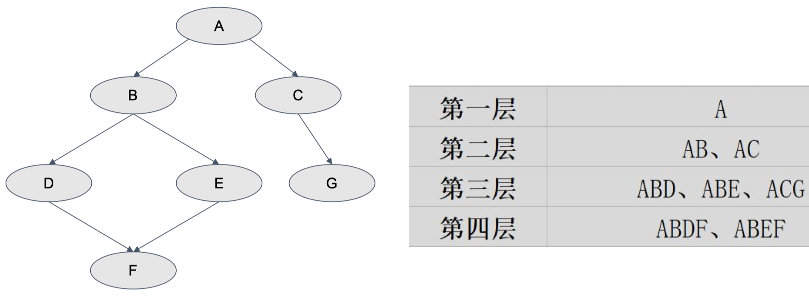
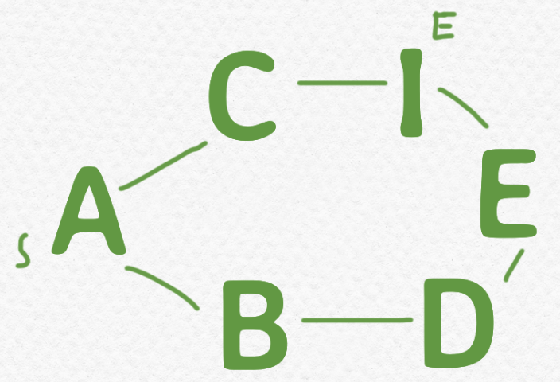
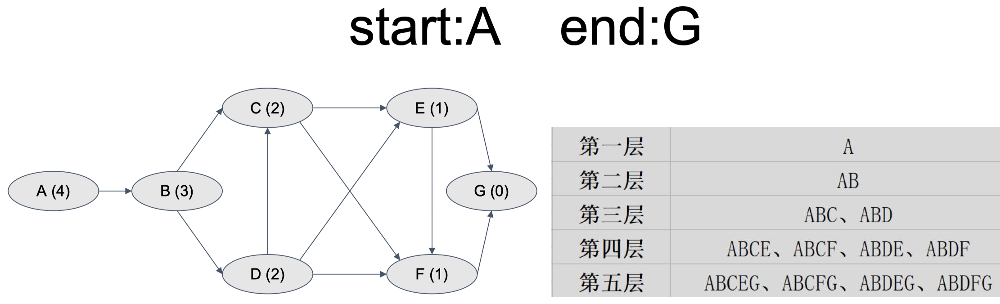
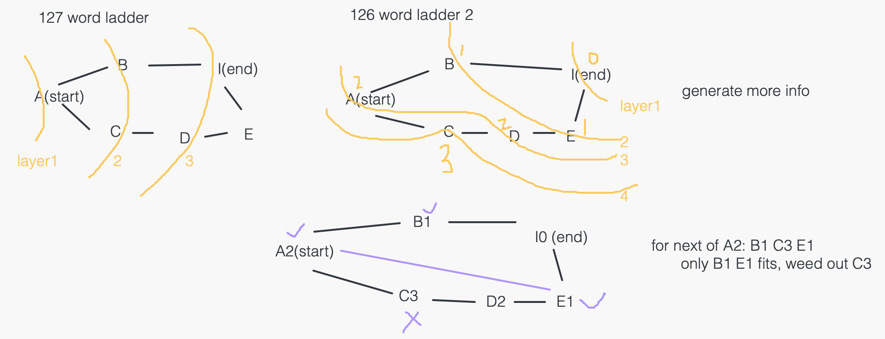

126. Word Ladder II

困难


https://leetcode.cn/problems/word-ladder-ii/


A transformation sequence from word beginWord to word endWord using a dictionary wordList is a sequence of words beginWord -> s1 -> s2 -> ... -> sk such that:
```
Every adjacent pair of words differs by a single letter.

Every si for 1 <= i <= k is in wordList. Note that beginWord does not need to be in wordList.

sk == endWord
```


Given two words, beginWord and endWord, and a dictionary wordList, return all the shortest transformation sequences from beginWord to endWord, or an empty list if no such sequence exists. Each sequence should be returned as a list of the words [beginWord, s1, s2, ..., sk].

 
```
Example 1:

Input: beginWord = "hit", endWord = "cog", wordList = ["hot","dot","dog","lot","log","cog"]

Output: [["hit","hot","dot","dog","cog"],["hit","hot","lot","log","cog"]]

Explanation: There are 2 shortest transformation sequences:
"hit" -> "hot" -> "dot" -> "dog" -> "cog"
"hit" -> "hot" -> "lot" -> "log" -> "cog"

Example 2:

Input: beginWord = "hit", endWord = "cog", wordList = ["hot","dot","dog","lot","log"]

Output: []

Explanation: The endWord "cog" is not in wordList, therefore there is no valid transformation sequence.
``` 

Constraints:
```
1 <= beginWord.length <= 5
endWord.length == beginWord.length
1 <= wordList.length <= 1000
wordList[i].length == beginWord.length
beginWord, endWord, and wordList[i] consist of lowercase English letters.
beginWord != endWord
All the words in wordList are unique.
```


相关企业

- 亚马逊 Amazon|10
- Facebook|4
- 微软 Microsoft|3
- 字节跳动|2

相关标签
- Breadth-First Search
- Hash Table
- String
- Backtracking

相似题目
- Word Ladder
困难

# idea

1. shortest path -> BFS
2. what to store in queue?
   - node? 
   - path? 
   - if only node you don't know path.
   - so we need to store path. E.g. the queue elements are paths: A, AB, ABC, ABCD 如果使用 BFS 找所有的路径，那么队列里放的就是路径



## Issues if only use BFS/DFS

many unuseful discovery!

For example:
- If only BFS, in previous example, we will visit "AB" "AC" because they are same distant to starting point. But "AC" is useless.
- If only DFS, in below example, we will visit "ABDEI"  and "ACI" while "ABDEI" is useless. 



How can we know we should visit "C" instead of "B" in above image? 
- We need to know the distance between each node and ending point.

## Best solution: 最优算法: BFS + DFS

- BFS: 求出所有点到终点的距离 
- DFS: 沿着离终点越来越近的路线找到所有路径




# solution



```py
class Solution:
    def findLadders(self, beginWord: str, endWord: str, wordList: List[str]) -> List[List[str]]:
        if not wordList:
            return []
        if endWord not in wordList:
            return []
        wordList.append(beginWord) # careful
        
        # bfs to record the distance between each node and endWord
        word2Dist = self.bfs(wordList, beginWord, endWord)
        print(word2Dist)

        # dfs to record path
        results = []
        self.dfs(beginWord, [beginWord], results, wordList, word2Dist, endWord)
        return results

    def dfs(self, currword, currpath, results, wordList, word2Dist, endWord):
        if currword == endWord:
            results.append(list(currpath))
            return
        
        for nextword in self.getAllPossibleNextWords(currword, wordList):
            if nextword in wordList:
                if word2Dist[nextword] != word2Dist[currword] - 1:
                    continue # only follow shortest path
                currpath.append(nextword)
                self.dfs(nextword, currpath, results, wordList, word2Dist, endWord)
                currpath.pop()

    def bfs(self, wordList, beginWord, endWord):
        queue = collections.deque([endWord])
        visited_and_distance = dict({endWord: 0}) 

        while queue:
            currword = queue.popleft()
            for nextword in self.getAllPossibleNextWords(currword, wordList):
                if nextword in visited_and_distance or nextword not in wordList:
                    continue
                visited_and_distance[nextword] = visited_and_distance[currword] + 1
                queue.append(nextword)
        return visited_and_distance

    def getAllPossibleNextWords(self, word, wordList):
        nextwords = []
        for i in range(len(word)):
            for char in "abcdefghijklmnopqrstuvwxyz":
                leftpart, rightpart = word[:i], word[i+1:]
                if char == word[i]:
                    continue
                newword = leftpart + char + rightpart
                if newword not in wordList:
                    continue
                nextwords.append(newword)
        return nextwords
```