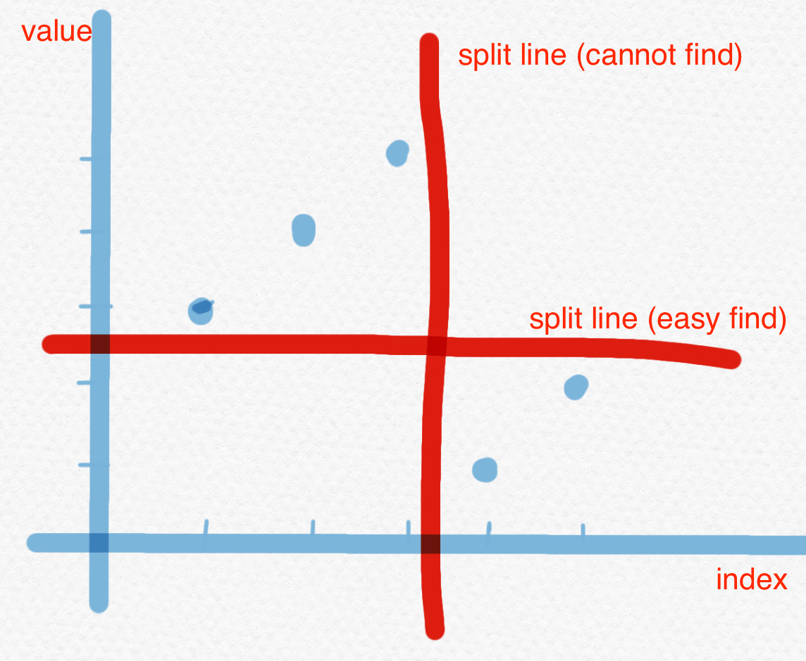

153. Find Minimum in Rotated Sorted Array

中等

https://leetcode-cn.com/problems/find-minimum-in-rotated-sorted-array/


Suppose an array of length n sorted in ascending order is rotated between 1 and n times. For example, the array nums = [0,1,2,4,5,6,7] might become:
```
[4,5,6,7,0,1,2] if it was rotated 4 times.
[0,1,2,4,5,6,7] if it was rotated 7 times.


Notice that rotating an array [a[0], a[1], a[2], ..., a[n-1]] 1 time results in the array [a[n-1], a[0], a[1], a[2], ..., a[n-2]].
```


Given the sorted rotated array nums of unique elements, return the minimum element of this array.

> You must write an algorithm that runs in O(log n) time.

 
```
Example 1:

Input: nums = [3,4,5,1,2]
Output: 1
Explanation: The original array was [1,2,3,4,5] rotated 3 times.

Example 2:

Input: nums = [4,5,6,7,0,1,2]
Output: 0
Explanation: The original array was [0,1,2,4,5,6,7] and it was rotated 4 times.

Example 3:

Input: nums = [11,13,15,17]
Output: 11
Explanation: The original array was [11,13,15,17] and it was rotated 4 times. 
``` 

Constraints:
```
n == nums.length
1 <= n <= 5000
-5000 <= nums[i] <= 5000
All the integers of nums are unique.
nums is sorted and rotated between 1 and n times.
```

相关企业
- Facebook|10
- 亚马逊 Amazon|9
- 微软 Microsoft|6
- 彭博 Bloomberg|3
- 高盛集团 Goldman Sachs|3
  
相关标签
- Array
- Binary Search

相似题目
- Search in Rotated Sorted Array
中等
- Find Minimum in Rotated Sorted Array II
困难

Hint
- 隐藏提示1
Array was originally in ascending order. Now that the array is rotated, there would be a point in the array where there is a small deflection from the increasing sequence. eg. The array would be something like [4, 5, 6, 7, 0, 1, 2].
- 隐藏提示2
You can divide the search space into two and see which direction to go. Can you think of an algorithm which has O(logN) search complexity?
- 隐藏提示3
All the elements to the left of inflection point > first element of the array.
All the elements to the right of inflection point < first element of the array.


# solution
1. It must be BS bc asking for O(logn)
2. We cannot use index to split but we can use value to split:
for nums = [3,4,5,1,2]:


## How to set the "target" value to split? 
- we can choose target = nums[len-1] or target = (nums[0] + nums[len-1])//2 
- we cannot use target = nums[0]  bc this don't work for corner case [1 2 3 4 5]

```py
class Solution:
    def findMin(self, nums: List[int]) -> int:
        if not nums:
            return -1

        numsleng = len(nums)
        start, end = 0, numsleng - 1
        target = nums[numsleng-1]

        # find the first elem <= target
        while start + 1 < end: # 控制区间大小
            mid = start + (end -  start) // 2
            if nums[mid] <= target: # 要左边一半
                end = mid
            else:
                start = mid
        return min(nums[start], nums[end])
```        

