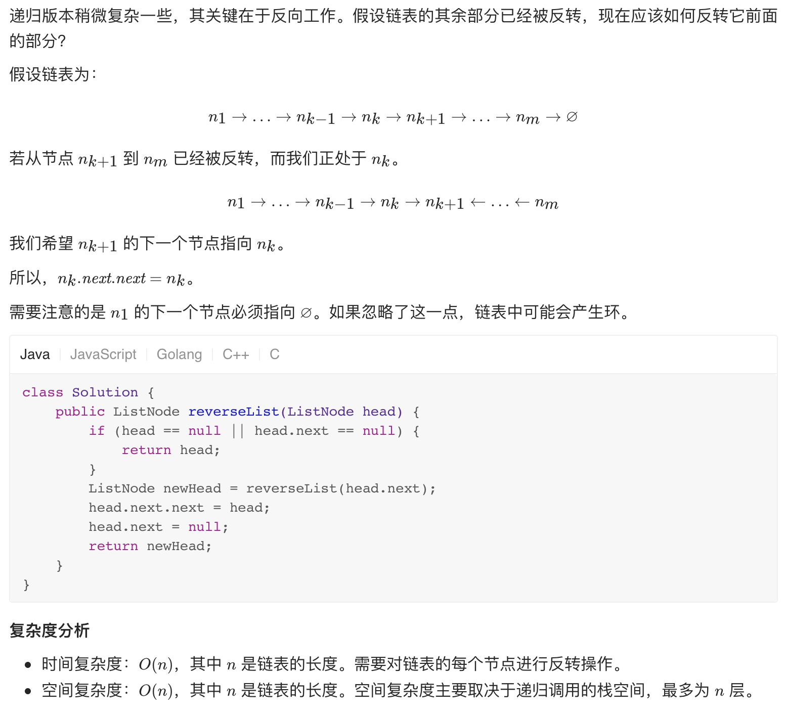
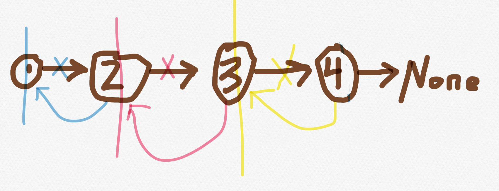

# 206.   Reverse Linked List
    
Easy https://leetcode-cn.com/problems/reverse-linked-list/ 


Given the head of a singly linked list, reverse the list, and return the reversed list.

```
Example 1:


Input: head = [1,2,3,4,5]
Output: [5,4,3,2,1]
```

k

```
Example 2:


Input: head = [1,2]
Output: [2,1]


Example 3:

Input: head = []
Output: []
```


Constraints:

- The number of nodes in the list is the range [0, 5000].
- -5000 <= Node.val <= 5000
 

Follow up: 
- A linked list can be reversed either iteratively or recursively. Could you implement both?

相关企业
- 微软 Microsoft|13
- 彭博 Bloomberg|9
- 亚马逊 Amazon|9
- Facebook|8
- 字节跳动|8

相关标签
- Recursion
- Linked List

相似题目
- Reverse Linked List II
中等
- Binary Tree Upside Down
中等
- Palindrome Linked List
简单

# sol




```java
/**
 * Definition for singly-linked list.
 * public class ListNode {
 *     int val;
 *     ListNode next;
 *     ListNode() {}
 *     ListNode(int val) { this.val = val; }
 *     ListNode(int val, ListNode next) { this.val = val; this.next = next; }
 * }
 */
class Solution {
    public ListNode reverseList(ListNode head) {
        if (head == null || head.next == null){
            return head;
        }

        ListNode tail = reverseList(head.next);
        head.next.next = head; 
        head.next = null;  
        return tail;
    }
}
```


```python
# Definition for singly-linked list.
# class ListNode:
#     def __init__(self, val=0, next=None):
#         self.val = val
#         self.next = next
class Solution:
    def reverseList(self, head: ListNode) -> ListNode:
        if not head or not head.next:
            return head
        
        newHead = self.reverseList(head.next)
        # at 3 level, change 4.next=3 (overwrite previous level except node1)
        head.next.next = head 
        # clean 3.next = None (will be overwrote in next level)
        # If don't do this, node1.next = node2 will cause cycle
        head.next = None
        return newHead
```

