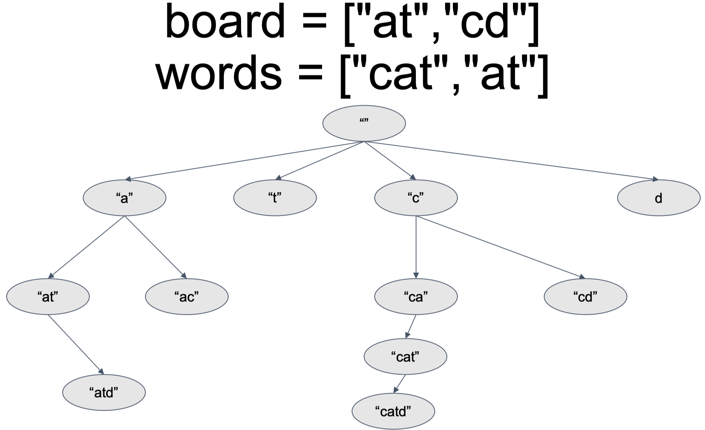

212. Word Search II


困难

https://leetcode.cn/problems/word-search-ii/


Given an m x n board of characters and a list of strings words, return all words on the board.

Each word must be constructed from letters of sequentially adjacent cells, where adjacent cells are horizontally or vertically neighboring. The same letter cell may not be used more than once in a word.

 

Example 1:


```
Input: board = [["o","a","a","n"],["e","t","a","e"],["i","h","k","r"],["i","f","l","v"]], words = ["oath","pea","eat","rain"]
Output: ["eat","oath"]
```

Example 2:


```
Input: board = [["a","b"],["c","d"]], words = ["abcb"]
Output: []
``` 

Constraints:
```
m == board.length
n == board[i].length
1 <= m, n <= 12
board[i][j] is a lowercase English letter.
1 <= words.length <= 3 * 104
1 <= words[i].length <= 10
words[i] consists of lowercase English letters.
All the strings of words are unique.
```


相关企业

- 优步 Uber|33
- 亚马逊 Amazon|31
- 思科 Cisco|12
- 微软 Microsoft|9
- 谷歌 Google|6
- Facebook|5
- Indeed|4
- 苹果 Apple|3


相关标签
- Trie
- Array
- String
- Backtracking
- Matrix


相似题目
- Word Search
中等
- Unique Paths III
困难

隐藏提示1
- You would need to optimize your backtracking to pass the larger test. Could you stop backtracking earlier?


隐藏提示2
- If the current candidate does not exist in all words' prefix, you could stop backtracking immediately. What kind of data structure could answer such query efficiently? Does a hash table work? Why or why not? How about a Trie? If you would like to learn how to implement a basic trie, please work on this problem: Implement Trie (Prefix Tree) first.

# think 使用哪种搜索策略

A: for 词典里的每个单词 { check 单词是否在矩阵里 } (sol 1)

B: for 矩阵的每个单词 { check 单词是否在词典里} (sol 2) prefix map, or data structure called "trie"



# sol 1 reuse 79 word search -- time over

for each word call 79.word search solution to solve

```py
class Solution:
    def findWords(self, board: List[List[str]], words: List[str]) -> List[str]:
        if not board:
            return []

        rowleng = len(board)
        colleng = len(board[0])

        founded_words = []
        for word in words:
            visited = [[False] * colleng for _ in range(rowleng)]
            found = False
            for i in range(rowleng):
                for j in range(colleng):
                    if board[i][j] == word[0]:
                        visited[i][j] = True
                        found = self.dfs(board, i, j, word, 1, [board[i][j]], visited, rowleng, colleng)
                        visited[i][j] = False
                        if found:
                            founded_words.append(word)
                            break
                if found:
                    break
        return founded_words

    def dfs(self, board, i, j, word, wordindex, currsubset, visited, rowleng, colleng):
        # print("".join(currsubset), word, wordindex)
        if wordindex > len(word):
            return False
        if "".join(currsubset) == word:
            return True

        for offsetx, offsety in [[0,1], [0,-1],[1,0],[-1,0]]:
            newx, newy = i + offsetx, j + offsety
            if not (0 <= newx <= rowleng-1 and 0 <= newy <= colleng-1) or visited[newx][newy]:
                continue
            newletter = board[newx][newy]
            if newletter == word[wordindex]:
                currsubset.append(newletter)
                visited[newx][newy] = True
                found = self.dfs(board, newx, newy, word, wordindex+1, currsubset, visited, rowleng, colleng)
                currsubset.pop()
                visited[newx][newy] = False
                if found:
                    return True
        return False
```

# sol 2 pre-process words and prepare all possible prefixes

```py
class Solution:
    def findWords(self, board: List[List[str]], words: List[str]) -> List[str]:
        if not board:
            return []

        rowleng = len(board)
        colleng = len(board[0])
        prefix_is_word = self.setupPrefix(words)
        resultsset = set()
        visited = [[False] * colleng for _ in range(rowleng)]

        for i in range(rowleng):
            for j in range(colleng):
                if board[i][j] in prefix_is_word:
                    visited[i][j] = True
                    self.dfs(board, i, j, board[i][j], prefix_is_word, resultsset, visited, rowleng, colleng)
                    visited[i][j] = False
        return list(resultsset)
    
    def dfs(self, board, i, j, currsubsetstr, prefix_is_word, resultsset, visited, rowleng, colleng):
        if currsubsetstr not in prefix_is_word:
            return
        if prefix_is_word[currsubsetstr]:
            resultsset.add(currsubsetstr)
        
        for offsetx, offsety in [[0, 1], [0, -1], [1, 0], [-1, 0]]:
            newx, newy = i + offsetx, j + offsety
            if not (0 <= newx <= rowleng-1 and 0 <= newy <= colleng-1) or visited[newx][newy]:
                continue
            visited[newx][newy] = True
            self.dfs(board, newx, newy, currsubsetstr+board[newx][newy], prefix_is_word, resultsset, visited, rowleng, colleng)
            visited[newx][newy] = False
            


    def setupPrefix(self, words):
        prefix_is_word = {}
        for word in words:
            for i in range(len(word)):
                prefix_is_word[word[:i+1]] = False
        for word in words:
            prefix_is_word[word] = True
        return prefix_is_word
```

# sol 3 trie

similar to sol2 but replace prefix map with trie

使用了 Trie 的版本 

考点：

- 字典树
- dfs
- tip:trie树，一种树形结构，是一种哈希树的变种。典型应用是用于统计，排序和保存大量的字符串（但不仅限于字符串），所以经常被搜索引擎系统用于文本词频统计。

题解：

- 首先建立字典树，字典树从root开始，每个节点利用hashmap动态开点，利用字母的公共前缀建树。
- 遍历字母矩阵，将字母矩阵的每个字母，从root开始dfs搜索，搜索到底部时，将字符串存入答案返回即可。

```py
class TrieNode:
    def __init__(self) -> None:
        self.children = dict()
        self.is_end_of_word = False # 是否是单词最后一个字母
        self.word = None # 为了方便也保存下完整单词

class Trie:
    def __init__(self) -> None:
        self.root = TrieNode()

    def add(self, word): #字典树插入单词
        currnode = self.root
        for letter in word:
            if letter not in currnode.children:
                currnode.children[letter] = TrieNode() #在此节点申请节点
            currnode = currnode.children[letter] #继续遍历
        currnode.is_end_of_word = True #last letter marked as end of word
        currnode.word = word #存入单词

class Solution:
    def findWords(self, board: List[List[str]], words: List[str]) -> List[str]:
        if not board:
            return []

        rowleng = len(board)
        colleng = len(board[0])
        trie = Trie()
        for word in words:
            trie.add(word)
            
        resultsset = set()
        visited = [[False] * colleng for _ in range(rowleng)]

        for i in range(rowleng):
            for j in range(colleng):
                if board[i][j] in trie.root.children: # root.children are all possible starting letters
                    visited[i][j] = True
                    self.dfs(board, i, j, trie.root.children.get(board[i][j]), trie, resultsset, visited, rowleng, colleng)
                    visited[i][j] = False
        return list(resultsset)
    
    def dfs(self, board, i, j, node, trie, resultsset, visited, rowleng, colleng):
        if node is None: 
            return
        if node.is_end_of_word:
            resultsset.add(node.word)
        
        for offsetx, offsety in [[0, 1], [0, -1], [1, 0], [-1, 0]]:
            newx, newy = i + offsetx, j + offsety
            if not (0 <= newx <= rowleng-1 and 0 <= newy <= colleng-1) or visited[newx][newy]:
                continue
            visited[newx][newy] = True
            self.dfs(board, newx, newy, node.children.get(board[newx][newy]), trie, resultsset, visited, rowleng, colleng)
            visited[newx][newy] = False
            
```