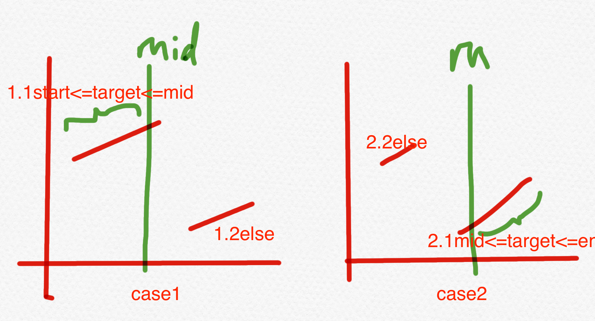

33. Search in Rotated Sorted Array

中等

https://leetcode-cn.com/problems/search-in-rotated-sorted-array/


There is an integer array nums sorted in ascending order (with distinct values).

Prior to being passed to your function, nums is possibly rotated at an unknown pivot index k (1 <= k < nums.length) such that the resulting array is [nums[k], nums[k+1], ..., nums[n-1], nums[0], nums[1], ..., nums[k-1]] (0-indexed). For example, [0,1,2,4,5,6,7] might be rotated at pivot index 3 and become [4,5,6,7,0,1,2].

Given the array nums after the possible rotation and an integer target, return the index of target if it is in nums, or -1 if it is not in nums.

You must write an algorithm with **O(log n)** runtime complexity.

 
```
Example 1:

Input: nums = [4,5,6,7,0,1,2], target = 0
Output: 4

Example 2:

Input: nums = [4,5,6,7,0,1,2], target = 3
Output: -1

Example 3:

Input: nums = [1], target = 0
Output: -1
``` 

Constraints:
```
1 <= nums.length <= 5000
-104 <= nums[i] <= 104
All values of nums are unique.
nums is an ascending array that is possibly rotated.
-104 <= target <= 104
```

相关企业

- 微软 Microsoft|31
- Facebook|26
- 亚马逊 Amazon|24
- 字节跳动|20
- 领英 LinkedIn|17

相关标签
- Array
- Binary Search

相似题目
- Search in Rotated Sorted Array II
中等
- Find Minimum in Rotated Sorted Array
中等

# sol 1:  use 2 times BS
```py
class Solution:
    def search(self, nums: List[int], target: int) -> int:
        if not nums:
            return -1

        minIndex = self.findMin(nums)
        # after find the min value, its left or right part is non-descenting array so we can BS
        if nums[minIndex] <= target <= nums[-1]:
            # must be right part [minIndex:]
            return self.binarysearch(nums, minIndex, len(nums)-1, target)
        # must be left part [:minIndex-1]
        return self.binarysearch(nums, 0, minIndex-1, target)


    def findMin(self, nums):
        start, end = 0, len(nums) - 1
        while start + 1 < end:
            target = nums[end]
            mid = start + (end - start) // 2
            if nums[mid] > target:
                start = mid
            elif nums[mid] <= target:
                end = mid
        if nums[start] <= nums[end]:
            return start
        return end
        
    def binarysearch(self, nums, start, end, target):
        while start + 1 < end:
            mid = start + (end - start) // 2
            if nums[mid] == target:
                return mid
            elif nums[mid] > target:
                end = mid
            else:
                start = mid
        if nums[start] == target:
            return start
        if nums[end] == target:
            return end
        return -1
            
```

# sol 2 only use 1 time BS but the if-else need to be  more complex

面试官：刚才这个题你写得太快了不算 
面试官：你能否只用一次二分就解决这个问题？ 
（答出来可以拿到 Strong Hire，答不出来也没关系)


方法2：加大难度
在一个Rotated Sorted Array上切一刀 
可以判断出这一刀切在左半部分还是右半部分 
这一刀的两边仍然是Rotated Sorted Array (所以可以iterate  or recursion)



```py
class Solution:
    def search(self, nums: List[int], target: int) -> int:
        if not nums:
            return -1

        start, end = 0, len(nums) - 1
        while start + 1 < end:
            mid = start + (end - start) // 2
            if nums[start] <= nums[mid]: # mid is left side of minValue
                if target >= nums[start] and target <= nums[mid]:
                    end = mid
                else:
                    start = mid
            elif nums[start] > nums[mid]: # mid is right side of minValue
                if target >= nums[mid] and target <= nums[end]:
                    start = mid
                else:
                    end = mid
        if nums[start] == target:
            return start
        if nums[end] == target:
            return end
        return -1
```