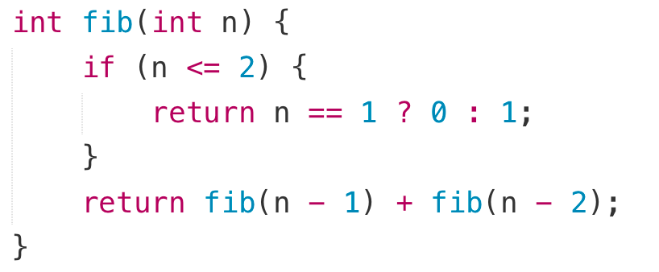
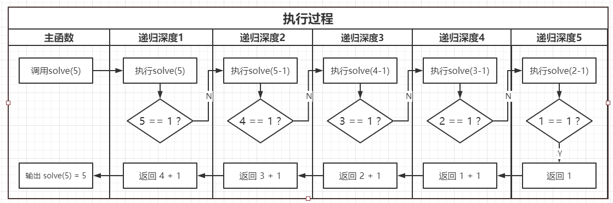

509. Fibonacci Number
难度
简单

https://leetcode-cn.com/problems/fibonacci-number/


The Fibonacci numbers, commonly denoted F(n) form a sequence, called the Fibonacci sequence, such that each number is the sum of the two preceding ones, starting from 0 and 1. That is,
```
F(0) = 0, F(1) = 1
F(n) = F(n - 1) + F(n - 2), for n > 1.
Given n, calculate F(n).

 

Example 1:

Input: n = 2
Output: 1
Explanation: F(2) = F(1) + F(0) = 1 + 0 = 1.

Example 2:

Input: n = 3
Output: 2
Explanation: F(3) = F(2) + F(1) = 1 + 1 = 2.

Example 3:

Input: n = 4
Output: 3
Explanation: F(4) = F(3) + F(2) = 2 + 1 = 3.
 

Constraints:

0 <= n <= 30
```


相关企业
- 亚马逊 Amazon|8
- 微软 Microsoft|5
- 字节跳动|3
- Facebook|3
- 高盛集团 Goldman Sachs|2

相关标签
- Recursion
- Memoization
- Math
- Dynamic Programming

相似题目
- Climbing Stairs
简单
- Split Array into Fibonacci Sequence
中等
- Length of Longest Fibonacci Subsequence
中等






# Method 1: Recursion: Time O(2^n), Space O(1) 空间复杂度为O(n)（不考虑递归的栈空间占用则为O(1)）

```py
class Solution:
    def fib(self, n: int) -> int:
        if n <= 1:
            return n
        return self.fib(n-1) + self.fib(n-2)
```

## Note:
纯用递归会超时，如果用带有记忆化的递归就可以，使用循环和记忆化递归的时间复杂度一样，都是
O
(
n)。

不超出Integer的斐波那契数很少，仅有50个左右。 但是使用纯的递归，复杂度会是
O
(
2^n
)
。因此会超时。

# Method 2: 循环 Time O(n) Space O(n)
```py
class Solution:
    def fib(self, n: int) -> int:
        if n <= 1:
            return n
        
        first, second = 0, 1
        for i in range(2, n):
            first, second = second, first + second
        return first + second
```        

# Method 3: Memorized Search: Time & Space O(n). 以空间换时间的优化算法——记忆化搜索。

顾名思义，它将计算出的结果存储下来，在计算到指定值的时候，先判断这个值是否已经计算过，若没有，才进行计算，否则读取已经存储下来的值。这样就把一个指数级复杂度变成了线性复杂度，代价是空间复杂度从常数级上升至线性级。

时间复杂度为O(n)，空间复杂度为O(n)。
```py
class Solution:
    def dfs(self, n, fib):
        if fib[n] != -1:
            return fib[n]
        if n <= 1:
            fib[n] = n 
            return fib[n]
        fib[n] = self.dfs(n - 1, fib) + self.dfs(n - 2, fib)
        return fib[n]
    
    def fib(self, n):
        result = [-1] * (n + 1) # is an array with len n+1 and all default value is -1. Used to store all results
        self.dfs(n, result)
        return result[n]
```


# Method 4: 递推法 Induction: Time & Space O(n)
它的时间复杂度和空间复杂度均为O(n)。


```py
class Solution:
    def fib(self, n):
        fib = [0, 1, 1]
        for i in range(3, n + 1, 1):
            fib.append(fib[i - 1] + fib[i - 2])
        return fib[n]
```

# Method 5: 滚动数组 Time O(n) Space O(1)

但是我们发现，这道题并不需要存储那么多的fibonacci数，因为是返回第n项，并且第n项只和前面的两个数字有关，所以利用一个长度为2的空间记录前两个数字即可。

此时时间复杂度不变，但是空间复杂度降为O(1)。

这种节省空间的方法其实就是动态规划的滚动数组思想。

```py
class Solution:
    def fibonacci(self, n):
        fib = [0, 1]
        for i in range(2, n + 1, 1):
            fib[i % 2] = fib[0] + fib[1]
        return fib[(n + 1) % 2]
```        


# Method 6: 矩阵快速幂

矩阵快速幂

先修知识1：快速幂：https://www.lintcode.com/problem/fast-power/description

先修知识2：矩阵的乘法运算原理。

在先修知识掌握之后，我们不禁要问：

为什么求一个fibonacci还能和矩阵、求幂扯上关系？

我们首先来看一个例子：

假设我们有一个2\*2的矩阵[[1,1],[1,0]]和一个2\*1的矩阵[[2],[1]]，将上面两个矩阵相乘会变成[[3],[2]]对吧，再用[[1,1][1,0]]和新的矩阵[[3],[2]]继续相乘又会变成[[5],[3]]，继续运算就是[[8],[5]]，[[13],[8]]......神奇的事情出现了，当我们不断地用这个[[1,1],[1,0]]乘上初始矩阵，得到的新矩阵的上面一个元素就会变成的fibonacci数列中的一个数字，下面的元素则是上面元素的前一项，而且每多乘一次，这个数字的下标就增加一。

那么这个矩阵是怎么来的呢？

从刚才的推理中我们发现：某个矩阵A乘上[[fib(n+1)],[fib(n)]]会变成[[fib(n+2)],[fib(n+1)]]。现在设矩阵A为[[a,b],[c,d]]，（为什么矩阵A是一个2\*2的矩阵？因为只有2\*2的矩阵乘一个2\*1的矩阵才会得到一个2\*1的矩阵。）那么可以列出下面的等式：
```
a * fib(n + 1) + b * fib(n) = fib(n + 2)

c * fib(n + 1) + d * fib(n) = fib(n + 1)
```
很容易地，我们得到：
```
1 * fib(n + 1) + 1 * fib(n) = fib(n + 2)

1 * fib(n + 1) + 0 * fib(n) = fib(n + 1)
```
也就是说矩阵A就是[[1,1],[1,0]]。

现在我们知道了原矩阵M连续多次乘上某个矩阵A会得到新的矩阵M'，并且M'的第一个元素就是我们想要的值。

根据矩阵的运算法则，中间的若干次相乘可以先乘起来，但是矩阵乘法的复杂度是O(n^3)，是不是一次一次的乘有点慢呢？这时候就是快速幂出场的时候了，我们可以使用快速幂来优化矩阵乘法的速度，这就是矩阵快速幂算法。

值得注意的是，在快速幂中，我们有一步操作是：int result = 1。那么如何使用矩阵来实现这个单位1呢，我们要借助单位矩阵。所谓的单位矩阵是一个从左上角到右下角对角线上都是1，其余位置都是0的边长相等的矩阵（方阵）。比如[[1,0,0],[0,1,0],[0,0,1]]。单位矩阵E的特性在于满足矩阵乘法的任意矩阵A\*E一定等于A，E\*A一定等于A。

所以本题需要将初始矩阵设置为[[1],[0]]，这样我们只需要将中间矩阵[[1,1],[1,0]]使用快速幂连乘n-2次，再和[[1],[0]]相乘，矩阵就变成了[[fib(n)],[fib(n-1)]]。

矩阵快速幂算法常常被应用在递推式的加速中，可以很轻松的递推至下标相当大的位置，而不用担心超时的问题。

但是要注意以下两点：

第一，矩阵快速幂使用的过程中要注意是否应该取模，因为C++和Java会有数值溢出，如果题目要求递推式取模，那么有很大概率是一道矩阵快速幂题目。

第二，矩阵乘法是没有交换律的（A\*B ≠ B\*A），因此我们一定要注意乘法顺序。

因为矩阵乘法的复杂度是矩阵长度 L 的三次方，需要乘logn次。所占的空间一般只有矩阵的空间，为L的平方。

因此时间复杂度为O(L^3*logn)，空间复杂度为O(L^2)。

```python
class Solution:
    def quickPow(self, a, n):
        base = a
        resultMatrix = Matrix(2, 2)
        resultMatrix.numbers[0][0] = 1
        resultMatrix.numbers[1][1] = 1
        while n > 0:
            if n % 2 == 1:
                resultMatrix = resultMatrix.multiply(base)
            base = base.multiply(base)
            n //= 2
        return resultMatrix
    
    def fibonacci(self, n):
        if n == 1:
            return 0
        
        startMatrix = Matrix(2, 1)
        rollingMatrix = Matrix(2, 2)
        
        startMatrix.numbers[0][0] = 1
        startMatrix.numbers[1][0] = 0
        rollingMatrix.numbers[0][0] = 1
        rollingMatrix.numbers[0][1] = 1
        rollingMatrix.numbers[1][0] = 1
        rollingMatrix.numbers[1][1] = 0
        rollingMatrix = self.quickPow(rollingMatrix, n - 2)
        startMatrix = rollingMatrix.multiply(startMatrix)
        return startMatrix.numbers[0][0]

class Matrix:
    def __init__(self, row, column):
        self.row = row;
        self.column = column;
        self.numbers = []
        for i in range(0, row, 1):
            self.numbers.append([0] * column)
        
    def multiply(self, a):
        newMatrix = Matrix(self.row, a.column)
        for i in range(0, newMatrix.row, 1):
            for j in range(0, newMatrix.column, 1):
                for k in range(0, newMatrix.column, 1):
                    newMatrix.numbers[i][j] = newMatrix.numbers[i][j] + self.numbers[i][k] * a.numbers[k][j]
        return newMatrix
```        
