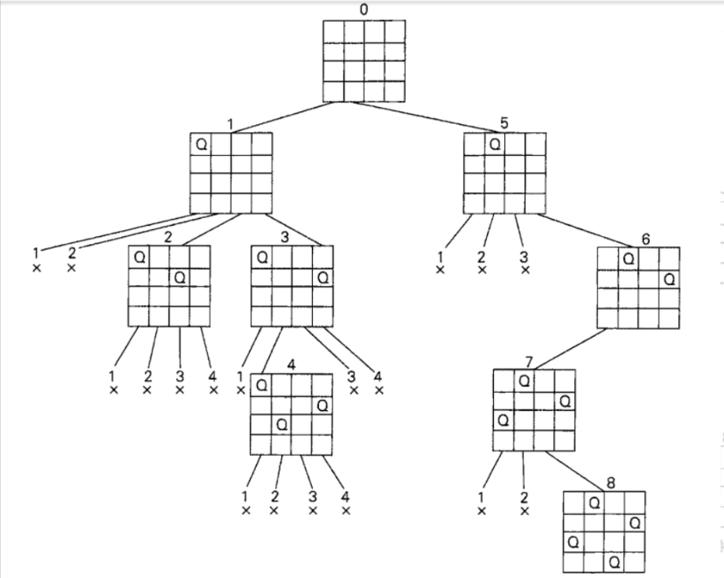

51. N-Queens

困难

https://leetcode.cn/problems/n-queens/


The n-queens puzzle is the problem of placing n queens on an n x n chessboard such that no two queens attack each other. (任意两个皇后不能位于同一行，同一列，同一斜线)

Given an integer n, return all distinct solutions to the n-queens puzzle. You may return the answer in any order.

Each solution contains a distinct board configuration of the n-queens' placement, where 'Q' and '.' both indicate a queen and an empty space, respectively.

 

Example 1:


```
Input: n = 4

Output: [[".Q..","...Q","Q...","..Q."],["..Q.","Q...","...Q",".Q.."]]

Explanation: There exist two distinct solutions to the 4-queens puzzle as shown above
```

Example 2:
```
Input: n = 1
Output: [["Q"]]
``` 

Constraints:
```
1 <= n <= 9
```

相关企业

- 字节跳动|10
- 亚马逊 Amazon|8
- Facebook|7
- 彭博 Bloomberg|5
- 微软 Microsoft|4
- 谷歌 Google|2
- 苹果 Apple|2


相关标签
- Array
- Backtracking

相似题目
- N-Queens II
困难
- Grid Illumination
困难

# 算法：dfs（回溯法）
## 题目分析

这个问题要求把n个皇后放在一个nXn的棋盘上，使得任何两个皇后都不能相互攻击，即它们不能同行，不能同列，也不能位于同一条对角线上。对于n=1，问题的解很简单，而且很容易看出对于n=2和n=3来说，这个问题是无解的。所以我们考虑4皇后问题，并用回溯法对它求解。

## 算法思路
因为每个皇后都必须分别占据一行，我们需要做的不过是棋盘上的每个皇后分配一列。

下面我们用4皇后的求解过程来讲解算法思路：

从空棋盘开始，然后把皇后1 放到它所在行的第-一个可能位置上，也就是第一-行第一列。

对于皇后2，在经过第-列和第二列的失败尝试之后，我们把它放在第一个可能的位置，就是格子(2, 3)，位于第二行第三列的格子。这被证明是一个死胡同，因为皇后3将没有位置可放。所以，该算法进行回溯，把皇后2放在下一个可能位置(2,4)上。这样皇后3就可以放在(3, 2),这被证明是另一个死胡同。该算法然后就回溯到底，把皇后1移到(1,2)。 接着皇后2到(2,4)， 皇后3到(3,1)， 而皇后4到(4, 3)， 这就是该问题的一个解。

整个过程实际上就是一个状态树的遍历过程

## 下图为状态树




## 代码思路
按行摆放，在确定一个皇后应该摆的列时，需要检查当前列是否合法，如果合法，则将皇后放置在当前位置，并进行递归，回溯。每行都摆满皇后时，则产生了一种解法，将所有解法收集并返回。

合法性判断方法：当前将要摆放皇后的位置和其他已摆放皇后的位置不能在同一列，且不能在同一条斜线上。这里判断是否在同一条斜线上可以通过两个皇后的位置横坐标之差和纵坐标之差的绝对值是否相等来判断。

## 空间复杂度：
O(N!)

## 时间复杂度：
O(方案总数 * 构造每个方案的时间)=O(S * N^2)

S 为 N 皇后的方案数. 

N^2 是画棋盘的时间

S = O(N!)

放置第一个皇后有 N 种可能，放置两个皇后不超过N(N-2)种可能，放置三个皇后不超过N(N - 2)(N - 4)种可能 ，以此类推。


```py
class Solution:
    def solveNQueens(self, n: int) -> List[List[str]]:
        results = []
        self.dfs([], n, results)
        return results

    def dfs(self, col, n, results):
        # col-list is used to record where queens are standing. N'th element presents n'th row so col-list is enough and no need row-list.
        #若已经放置了n个皇后表示出现了一种解法，绘制后加入答案result
        if len(col) == n:
            results.append(self.drawOneRow(col))
            return
        
        for next_coli in range(n):
            if not self.isValid(col, next_coli):
                continue
            #若合法则递归枚举下一行的皇后
            col.append(next_coli)
            self.dfs(col, n, results)
            col.pop()

    # 将col数组转换为答案的str-list格式
    def drawOneRow(self, col):
        n = len(col)
        board_str = []
        for rowi in range(n):
            row = []
            for coli in range(n):
                if col[rowi] == coli:
                    row.append("Q")
                else:
                    row.append(".")
            board_str.append("".join(row))
        return board_str

    # check next_coli valid or not
    def isValid(self, col, next_coli):
        next_rowi = len(col) 
        for rowi, coli in enumerate(col):
            # no need to check whether same row bc it's impossible
            if coli == next_coli:# cannot same col
                return False
            if abs(rowi - next_rowi) == abs(coli - next_coli): # cannot on the same diagonal
                return False
        return True
```