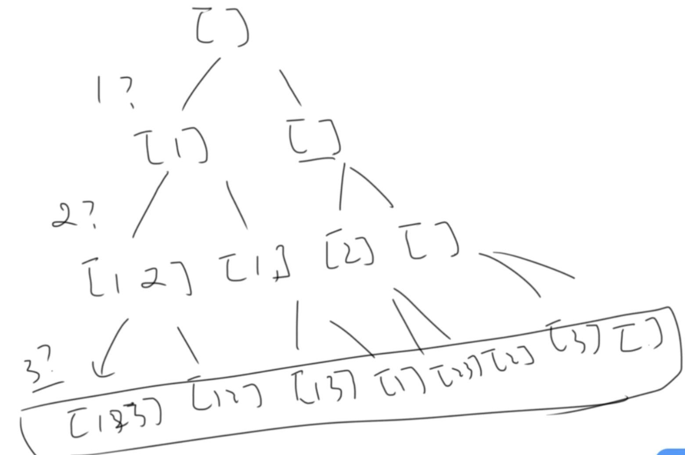
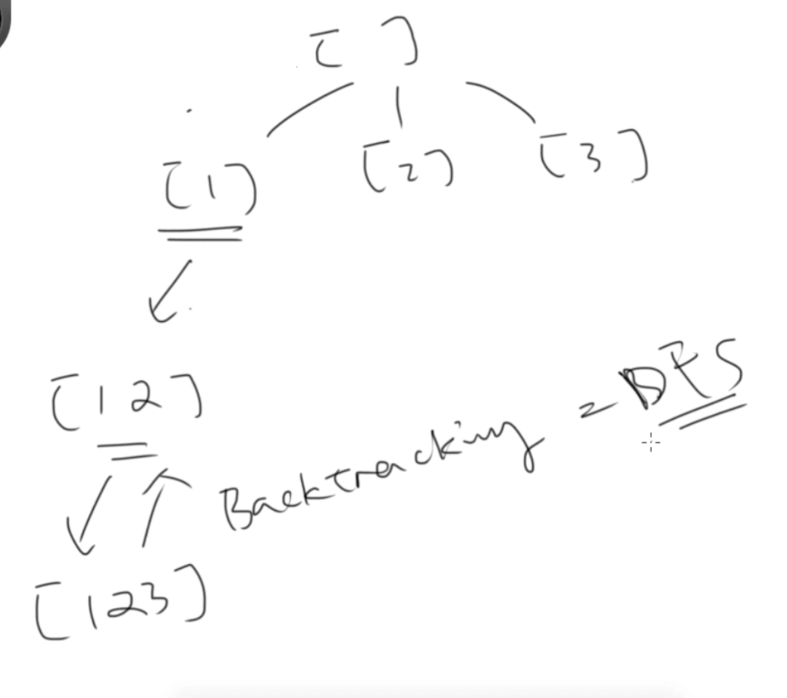
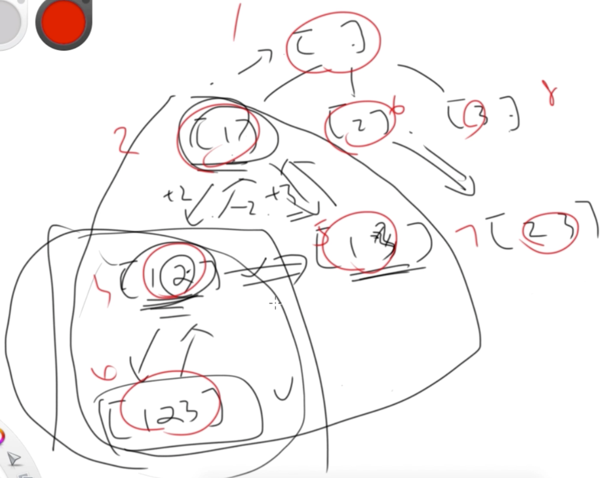

78. Subsets

中等

https://leetcode-cn.com/problems/subsets/

Given an integer array nums of unique elements, return all possible subsets (the power set).

The solution set must not contain duplicate subsets. Return the solution in any order.

 
```
Example 1:

Input: nums = [1,2,3]
Output: [[],[1],[2],[1,2],[3],[1,3],[2,3],[1,2,3]]

Example 2:

Input: nums = [0]
Output: [[],[0]]
``` 

Constraints:
```
1 <= nums.length <= 10
-10 <= nums[i] <= 10
All the numbers of nums are unique.
```

相关标签
- Bit Manipulation
- Array
- Backtracking

相似题目
- Subsets II
中等
- Generalized Abbreviation
中等
- Letter Case Permutation
中等

# combination
- find all subsets
- C(n, 0) + C(n, 1) + C(n, 2) + ... + C(n,n) == 2^n

From another perspective:

- for nums = [1,2,3]
  - 100 means [1]
  - 010 means [2]
  - 001 means [3]
  - 110 menas [1, 2]
  - so totally it's 2^n

# sol - 使用组合类搜索的专用深度优先搜索算法。 一层一层的决策每个数要不要放到最后的集合里。 DFS  recursion - take or not  take



```py
class Solution:
    def subsets(self, nums: List[int]) -> List[List[int]]:
        if not nums:
            return []
        
        results = []
        self.dfs(nums, 0, [], results)
        return results
    
    #  递归三要素
    #  1. 递归的定义：在 Nums 中找到所有以 subset 开头的的集合，并放到 results
    def dfs(self, nums, curr_index, curr_subset, results):
        # 3. 递归的出口
        if curr_index >= len(nums):
            # deep copy
            results.append(list(curr_subset))
            return results

        # 2. 递归的拆解
        # (如何进入下一层)
        
        # 选了 nums[index]
        curr_subset.append(nums[curr_index])
        self.dfs(nums, curr_index + 1, curr_subset, results)
        # 不选 nums[index]
        curr_subset.remove(nums[curr_index])
        self.dfs(nums, curr_index + 1, curr_subset, results)
```        

- 复杂度分析

- 时间复杂度：
O
(
n
∗
2^
n
)
，其中n为nums的长度。生成所有子集，并复制到输出集合中。
- 空间复杂度：
O
(
n
∗
2^
n
)
，其中n为nums的长度。存储所有子集，共 n个元素，每个元素都有可能存在或者不存在。

# sol 2 使用比较通用的深度优先搜索方法 DFS backtrack  -  for loop options





```py
class Solution:
    def subsets(self, nums: List[int]) -> List[List[int]]:
        if not nums:
            return []
        
        results = []
        self.dfs(nums, 0, [], results)
        return results
    
    #  递归三要素
    #  1. 递归的定义：在 Nums 中找到所有以 subset 开头的的集合，并放到 results
    def dfs(self, nums, startindex, curr_subset, results):
        # 2. 递归的拆解
        # deep copy
        results.append(list(curr_subset))

        # (如何进入下一层)
        for i in range(startindex, len(nums)):
            # [1] -> [1, 2]
            # 去寻找以[1,2]开头的所有子集
            curr_subset.append(nums[i])
            self.dfs(nums, i + 1, curr_subset, results)
            # [1,2] -> [1]
            curr_subset.pop(len(curr_subset) - 1) # backtracking # == curr_subset.remove(nums[i])

        # 3. 递归的出口
        return
```

```py
class Solution:
    def subsets(self, nums: List[int]) -> List[List[int]]:
        if not nums:
            return []
        
        results = []
        self.dfs(nums, 0, [], results)
        return results
    
    #  递归三要素
    #  1. 递归的定义：在 Nums 中找到所有以 subset 开头的的集合，并放到 results
    def dfs(self, nums, startindex, curr_subset, results):
        # 2. 递归的拆解
        results.append(curr_subset)

        # (如何进入下一层)
        for i in range(startindex, len(nums)):
            # [1] -> [1, 2]
            # 去寻找以[1,2]开头的所有子集
            new_subset = list(curr_subset) # create a new
            new_subset.append(nums[i])
            self.dfs(nums, i + 1, new_subset, results)

        # 3. 递归的出口
        return
```

# sol  3 - BFS
layer by layer
```
[] 
[1] [2] [3]
[1, 2] [1, 3] [2, 3]
[1, 2, 3]
```

