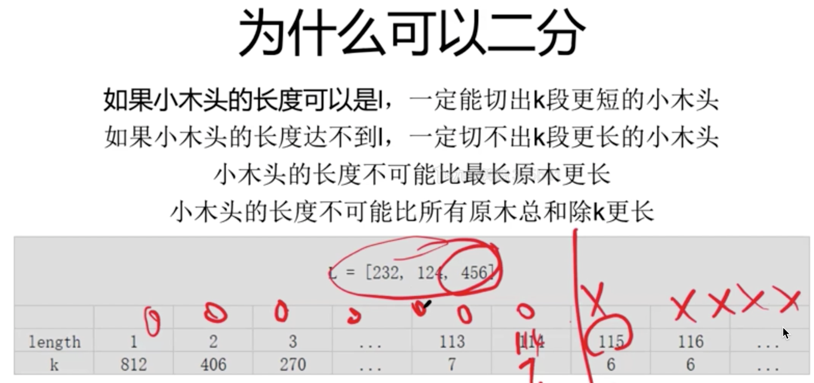

183 · Wood Cut


Hard

https://www.lintcode.com/problem/183/


Description
```
Given n pieces of wood with length L[i] (integer array). Cut them into small pieces to guarantee you could have equal or more than k pieces with the same length. What is the longest length you can get from the n pieces of wood? Given L & k, return the maximum length of the small pieces.

The unit of length is centimeter.The length of the woods are all positive integers,you couldn't cut wood into float length.If you couldn't get >= k pieces, return 0.
```

Example
```
Example 1

Input:
L = [232, 124, 456]
k = 7
Output: 114
Explanation: We can cut it into 7 pieces if any piece is 114 long, however we can't cut it into 7 pieces if any piece is 115 long.
And for the 124 logs, the excess can be discarded and not used in its entirety.


Example 2

Input:
L = [1, 2, 3]
k = 7
Output: 0
Explanation: It is obvious we can't make it.
```

Challenge
> O(n log Len), where Len is the longest length of the wood.

Tags
- Binary Search on Answer
- Binary Search

Related Problems
- 1917
Cutting Metal Surplus
Medium
- 1791
Simple queries
Medium
- 1671
play game
Hard

# sol

- 如果切长度为1的木头，可以切812块。（232+124+456=812）
- 如果切长度为2的木头，可以切406块。其中232切出116块，124切出62块，456切出228块。共116+62+228=406.
- 。。。


在答案范围上可以OOOOXXXX分类

如果ooxxooxx也不能二分


## 如何确定右边界

1. <= max(L). 
   如果要切L+1长度的木头，一根都切不出来
2. <= sum(L) // k 

## O(nlogMAX(L)) 

```py
from typing import (
    List,
)

class Solution:
    """
    @param l: Given n pieces of wood with length L[i]
    @param k: An integer
    @return: The maximum length of the small pieces
    """
    def wood_cut(self, l: List[int], k: int) -> int:
        # write your code here
        if not l:
            return 0

        lengstart, lengend = 1, min(max(l), sum(l)//k)
        if lengstart > lengend:
            return 0

        # BS on the answer set, which is length-K table
        while lengstart + 1 < lengend:
            lengmid = (lengstart + lengend) // 2
            if self.get_pieces(l, lengmid) >= k:
                lengstart = lengmid
            else: 
                lengend = lengmid 

        if self.get_pieces(l, lengend) >= k:
            return lengend
        if self.get_pieces(l, lengstart) >= k:
            return lengstart
        return 0
            

    # O(n)
    def get_pieces(self, L, length):
        return sum(l // length for l in L)
```        