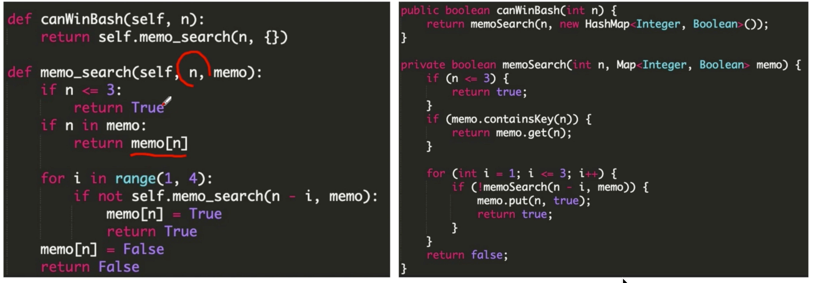
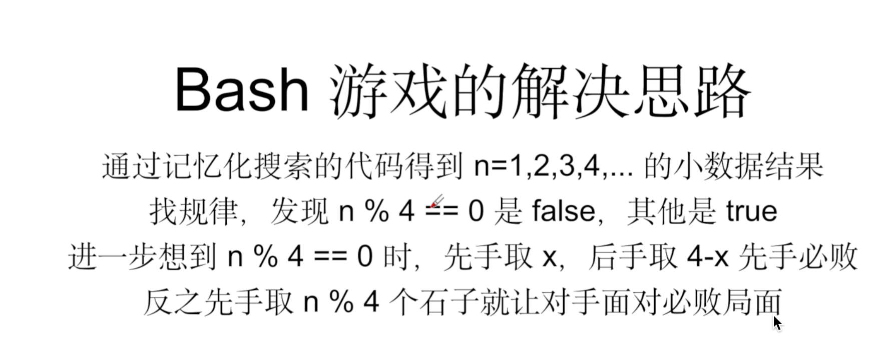

# 1 Memoization  Search

## 记忆化搜索Memoization Search
- 使用HashMap/Dict记录搜索的中间结果从而避免重复计算的算法
- 将函数的计算结果保存起来，下次通过同样的参数访问时，直接返回保存下来的结果
- 将指数级别的时间复杂度降到多项式级别 O(2^n) to O(n^2)


因为我们已经以一种方式（HashMap）记录了所有路径。所以每一对x和y只出现了一次，也就是 n^2 级别，相当于每一对起点终点都计算了一次，也就是 O(n^2) 。


## 对这个函数的限制？
- 函数需要有参数和返回值，没有则无法hashmap （DC中的返回值那样）
- 函数需要时pure function，即结果只和传入参数有关和其他无关
- 和系统设计中的cache很像

## 记忆化搜索-本质：动态规划
动态规划 和分治 的区别： 重复计算 （triangle中有重复部分，和binary tree不一样）
- 分完之后左右部分有交集=》动态规划
- 分完之后左右部分没有交集=》分治法

## 记忆化搜索是动态规划的一种 实现方式
搜索实现方式 ：
- BFS
- DFS 
  - Recursion
  - Stack/non-recursion
  
动态规划实现方式：
- Memoization search
- non-recursion/for loop  
 


## 记忆化搜索的缺陷

并不是所有的算法都适用于所有的问题，那么记忆化搜索可能会出现什么样的问题呢?

- 巴什博弈（Bash Game）
  - 记忆化搜索 - 你认为这段代码的最主要的问题在哪里?
  - 递归深度过高。
    - 这个问题的时间复杂度是 O(n) 级别，所以时间上我们可以接受，但是因为时间是 O(n)，最差情况的递归深度就变成了 O(n)，这是很容易爆栈（stack overflow）的。而递归出口就是边缘数据的判断，因此不存在“边缘数据没有进行判断”的情况。




- 记忆化搜索的缺点：
    - 如果时间复杂度和递归深度都是O(n)级别则会栈溢出 (eg. 1300 bash game)（递归级别别超过10万）
      - 一般时间要求1s内，那就是大约数量级10^8，即1千万。Linux内Heap一般是8M，一般一层递归 变量占几十字节，比如20， 那么8M/20=40万。也是10万级别。
    - 如果时间复杂度是O(n^2)级别，递归深度是O(n)级别就不会栈溢出 （eg. 109 triangle）
    - 不适合解决O(n)时间复杂度的DP问题，有stackoverflow的风险。（这些问题可用forloop）
- 记忆化搜索的优点：
    - 从搜索转化来，所以思维模式比较简单，在原来搜索基础上加几行代码即可
    - 实现起来不容易出错，依赖关系简单，可直接从依赖关系的逻辑转化为代码


# 2 动态规划


# 什么是动态规划

- 核心思想： 由大化小
- 类似算法： 递归、分治法

## DP 和 DC区别
- 是否有重复子问题
  - 比如二叉树左子树、右子树：不重复-》DC
  - 比如triangle，左下半、右下半：重复=》DP

## DP vs Greedy
- DP 会为了长远利益损失当前利益
- Greedy 永远追求当前利益最大化


# 自底向上和自顶向下的动规实现方式
- 记忆化搜索（使用递归实现）
- 多重循环/递推（使用for循环实现）


# 动态规划的四要素
- 状态 state
- 方程 state transition funciton
- 初始化 initialize/base case
- 答案 answer

## 递归四要素 vs 动规四要素

  - 动规的状态 State —— 递归的定义
    - 用 ```dp[i]``` 或者 ```dp[i][j]``` 代表在某些特定条件下某个规模更小的问题的答案
    - 规模更小用参数 i,j 之类的来划定
  - 动规的方程 Function —— 递归的拆解
    - 大问题如何拆解为小问题
    - ```dp[i][j]``` = 通过规模更小的一些状态求 max / min / sum / or 来进行推导
  - 动规的初始化 Initialize —— 递归的出口
    - 设定无法再拆解的极限小的状态下的值
    - 如 ```dp[i][0]``` 或者 ```dp[0][i]```
  - 动规的答案 Answer —— 递归的调用
    - 最后要求的答案是什么
    - 如 ```dp[n][m]``` 或者 ```max(dp[n][0], dp[n][1] … dp[n][m])```

## 递归四要素完全对应动规四要素

这也就是为什么动态规划可以使用 “递归”版本的记忆化搜索来解决的原因！


- UniquePath
UniquePath的实现
UniquePath自底向上
UniquePath Java


