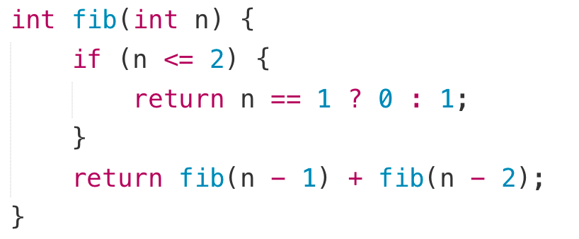
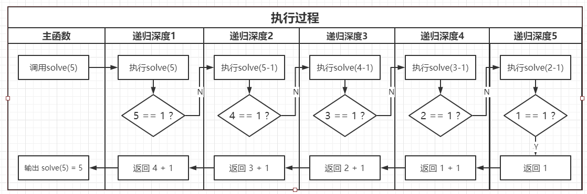

- Part 1 递归三要素 Recursion 3 key parts 
- Part 2 递归调用栈 (内存的堆栈 函数调用栈) Recursion with stack and heap 
- Part 3 值传递与引用传递 Pass by value vs Pass by reference 
- Part 4 递归和tree, binary search 二分法递归版本
- 综合训练 More practices 


# 1. 递归定义

- 当函数直接或者间接调⽤⾃⼰时，则发⽣了递归.
- 递归的定义: 参⻅ "递归的定义".
- 递归缩写:

    • Bing - Bing Is Not Google

    • GNU - GNU's Not Unix

    • PHP - PHP: Hypertext Preprocessor

# 递归三要素

- 递归的定义：接受什么参数，返回什么值，代表什么意思

- 递归的拆解：每次递归都是为了让问题规模变⼩

- 递归的出⼝：必须有⼀个明确的结束条件

=> 得到⼀个可供其他函数调⽤的递归函数

## 例子 斐波那契数列

- 定义: 斐波那契数列指的是这样⼀个数列 0, 1, 1, 2, 3, 5, 8, 13, 21, 34........这个数列从第3项 开始, 每⼀项都等于前两项之和.

- 关系式: F i= F i−1 + F i−2






# 2. 内存中的堆栈 Stack and Heap in Memory

- 递归深度太⼤容易 “爆栈” Stack Overflow, Segment Fault
- 堆空间:
  - 存放 new 得到的对象
  - ⽆限制 (剩余内存⼤⼩)
- 栈空间:
  - 存放对象的引⽤, 值类型变量(Java), 数组(C/C++), 以及函数调⽤信息
  - 有限制, ⼀般很⼩, MB量级


# 函数调用栈

- 想象⼀个 “圆筒”, 调⽤的函数需要放到筒⾥
- 第⼀个进⼊ “圆筒” 的是 main() 函数
- 每发⽣⼀次新的函数调⽤, 就会有⼀个新函数进⼊ “圆筒”
- 正在执⾏的就是最上⾯的函数
- ⼀个函数执⾏完毕, 就会被拿出来
- ⼀个函数占⽤ “圆筒” 的空间与参数, 局部变量的数量有关

## Stack overflow

- Java 
  - About 18615 recursion delpth. (18073 recursion delpth when more varibales)
- C/C++ 
  - About 262009 recursion delpth. (174672 recursion delpth when more varibales)
- Python 
  - About 998 recursion delpth. (998 recursion delpth when more varibales)
  - Not stackoverflow. 
  - “RuntimeError: maximum recursion depth exceeded”. 
  - Inside the setting of python, the max levels of recursion is set as about 999. 

[More about stack and heap and stackoverflow 更多关于栈、堆和溢出](recursion_stackheap_more.md)

# 3. 值传递与引用传递 Pass by value vs Pass by reference 

## 函数调用时值的传递：

- Java 值传递, 引⽤传递

- C++ 值传递, 引⽤传递, 地址传递

- Python 值传递, 引⽤传递

## 值传递：
- “盗梦空间” 中, 下层梦境中的⼈的⽣死与上层梦境⽆关

- 创建⼀个新的变量, 把值拷⻉ —— 相当于⼀个副本
```java
void func(int x){
	x ++;
	print(x);
}
int x=0;
func(x);
print(x);
```

- Java 基本数据类型 (byte, short, int, long, float, double, char, boolean)

- C++ 默认值传递

- Python 值类型 (类似于 Java)

- Java 类成员中, 若有 final 修饰, 可以认为具有值传递的特性

## 引用传递

- Java 类的实例

- C++ 在参数列表中加 & 修饰

- Python 引⽤类型 (类似于 Java, ⽐如列表, 类的实例)

- Java 类成员中, 若有 final 修饰, 可以认为是值传递

|值传递|引用传递|
|-|-|
|Java 基本数据类型 (byte, short, int, long, float, double, char, boolean)|Java 类的实例|
|C++ 默认值传递|C++ 在参数列表中加 & 修饰|
|Python 值类型 (类似于 Java)|Python 引⽤类型 (类似于 Java, ⽐如列表, 类的实例)|
|Java 类成员中, 若有 final 修饰, 可以认为具有值传递的特性||
||

## 递归与值传递/引⽤传递的关系

- 值传递和引⽤传递的主要区别: 内容是否复制

  - 空间占⽤ / 时间消耗

  - 修改是否影响上⼀层

- 递归要在保证正确性的前提下, 尽可能提⾼效率

- 需要考虑不仅仅参数传递, 还有返回值


# 4. 递归和tree, binary search 二分法递归版本


# Binary Tree

## Traversal
- Binary Tree Inorder Traversal
- Binary Tree Preorder Traversal
- Binary Tree Postorder Traversal

### 确定⼀棵⼆叉树
- 三种遍历序列, 其中⼀个相同, ⼆叉树不⼀定相同
  - 中序序列相同, 前序序列相同, ⼆叉树相同
  - 中序序列相同, 后序序列相同, ⼆叉树相同
  - 由⼆叉树的中序序列再加上前/后序序列之⼀即可确定⼀棵⼆叉树 (⽆重复节点)


# 其他题目 记得做呀！


251类似题目 以后联系

Flatten Nested List Iterator
https://leetcode-cn.com/problems/flatten-nested-list-iterator/

Flatten Binary Tree to Linked List
https://leetcode-cn.com/problems/flatten-binary-tree-to-linked-list/


这里继续

Flatten list 列表扁平化
[22.Flatten list 列表扁平化 2解法](../lintcode/22.flatten_list.md)


这里继续


  


---
还没做:


Hard [94. 124. Binary Tree Maximum Path Sum](9chapters/lintcode/94.124.md) 

---

551
1.   Nested List Weight Sum

Judge: https://www.lintcode.com/problem/nested-list-weight-sum/description

Solution: https://www.jiuzhang.com/solution/nested-list-weight-sum/

1.    Convert Sorted Array to Binary Search Tree

Judge: https://www.lintcode.com/problem/convert-sorted-array-to-binary-search-tree/description

Solution: https://www.jiuzhang.com/solution/convert-sorted-array-to-binary-search-tree/

coding...

1.    Maximum Binary Tree

Judge: https://www.lintcode.com/problem/maximum-binary-tree/description

Solution: https://www.jiuzhang.com/solution/maximum-binary-tree/

coding...

1.   Same Tree

Judge: https://www.lintcode.com/problem/same-tree/description

Solution: https://www.jiuzhang.com/solution/same-tree/

coding...


1.   Tweaked Identical Binary Tree

Judge: https://www.lintcode.com/problem/tweaked-identical-binary-tree/description

Solution: https://www.jiuzhang.com/solution/tweaked-identical-binary-tree/

coding...

1.   Tower of Hanoi

Judge: https://www.lintcode.com/problem/tower-of-hanoi/description

Solution: https://www.jiuzhang.com/solution/tower-of-hanoi/

coding...

